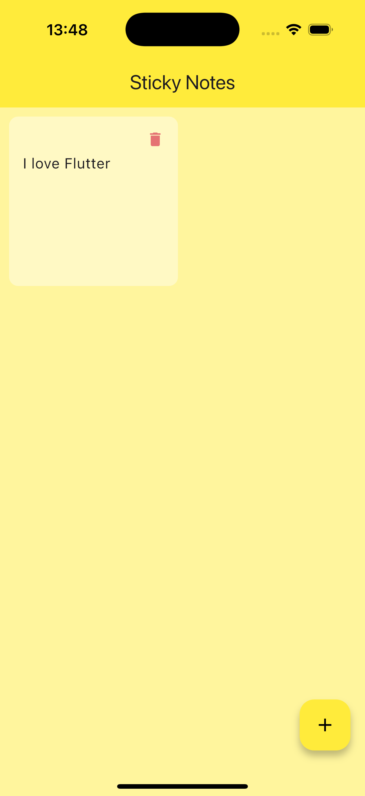
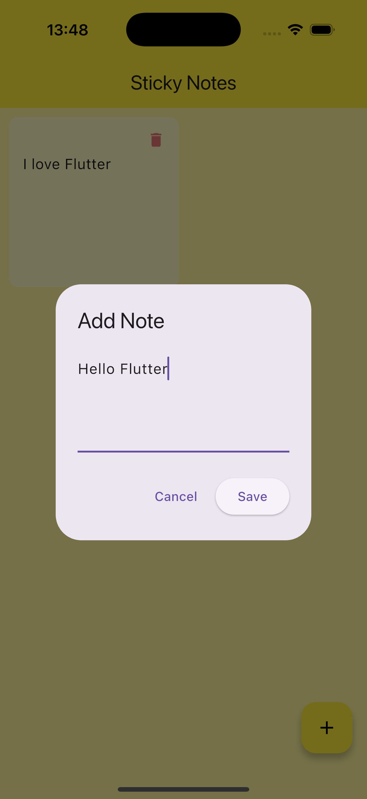

# 📝 Note Taking App (Flutter + Hive)

A minimal text editor that saves your thoughts permanently on the device. This project teaches **Local Database Storage** using Hive, a popular NoSQL alternative to SQLite.

  
  

## 🎯 Learning Outcomes
- **Hive Database:** Initializing, opening boxes, and reading/writing data.
- **Persistence:** Saving data to the device's file system.
- **ValueListenableBuilder:** Automatically rebuilding the UI whenever the database changes (no manual `setState` needed for the list!).
- **CRUD:** Create, Read, Update, Delete operations on a persistent database.

## 📱 Features
- **Auto-Save:** Notes are saved immediately when added.
- **Persistent Storage:** Data remains even after killing the app.
- **Delete:** Swipe or tap to remove notes permanently.
- **Clean UI:** A simple grid or list view of your thoughts.

## 🛠️ Tech Stack
- Flutter
- `hive_flutter` (Package) for the database.

## 🚀 How to Run
1. Clone the repo.
2. Run `flutter pub get`.
3. Run `flutter run`.

## 🔙 Back to Main Repo

Find more projects and the full learning roadmap here:
[Flutter Example Apps](https://github.com/thaisangdang/flutter_example_apps)

## 📘 Want to Build Bigger Apps?

This project is just the beginning. If you want to learn how to architect production-ready applications with scalable code, check out my premium guide:

👉 [**Master Flutter Architecture - Build a Production-Ready Social App from Scratch**](https://thaisang.gumroad.com/l/flutter-architecture-build-a-social-app)

## ☕ Support My Work

If you found this project helpful, consider [buying me a coffee](https://buymeacoffee.com/thaisangdang) to keep my work coming!